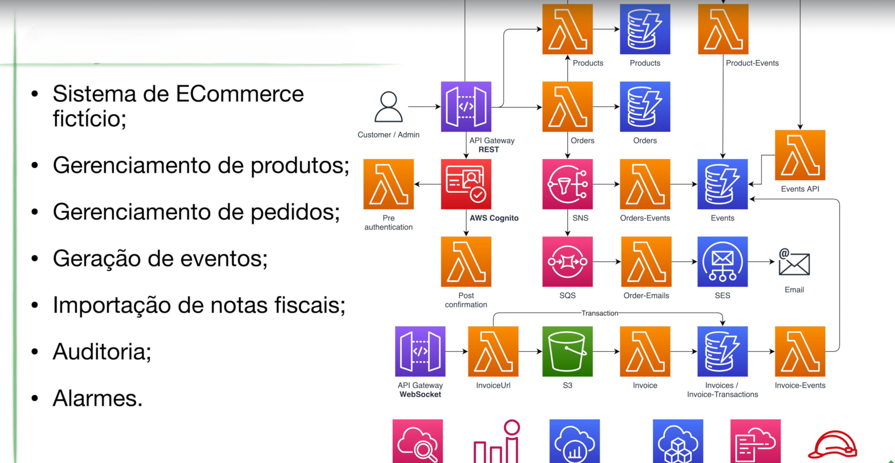

A arquitetura é projetada para ser escalável, confiável e segura, utilizando diversos serviços da AWS para garantir uma experiência de compra online excepcional.

### Componentes

* **Amazon S3 (Simple Storage Service):** Armazena os arquivos estáticos da loja virtual, como HTML, CSS, JavaScript e imagens, além das notas fiscais em formato XML.

* **Amazon DynamoDB:** Banco de dados NoSQL altamente escalável e flexível, utilizado para armazenar informações sobre produtos, pedidos e clientes.

* **AWS Lambda:** Funções serverless que executam o código da aplicação, como processamento de pedidos, validação de dados, geração de relatórios, etc.

* **Amazon API Gateway:** Cria uma API RESTful que permite a interação com ecommerce a partir de aplicativos externos e da interface do usuário.

* **Amazon Cognito:** Serviço de gerenciamento de identidade que permite autenticar e autorizar usuários, além de gerenciar o cadastro e login de clientes.

* **Amazon SNS (Simple Notification Service):** Serviço de mensagens pub/sub que envia notificações por e-mail (SES) ou SMS para clientes e administradores da loja.

* **Amazon SES (Simple Email Service):** Serviço de envio de e-mails transacionais, usado para enviar notificações de pedidos, confirmações de cadastro, etc.

* **AWS X-Ray:** Serviço de rastreamento distribuído que ajuda a analisar e depurar solicitações à API Gateway e às funções Lambda.

* **Amazon CloudWatch:** Serviço de monitoramento que coleta logs e métricas dos serviços da AWS, permitindo acompanhar o desempenho da loja virtual e configurar alarmes.

* **AWS CloudFormation:** Serviço de infraestrutura como código (IaC) que permite provisionar e gerenciar os recursos da AWS de forma automatizada e repetível.

### Fluxo de Trabalho

1. O cliente acessa a loja virtual através de um navegador web.
2. O CloudFront entrega os arquivos estáticos (HTML, CSS, JavaScript) armazenados no S3.
3. O cliente interage com a loja virtual, enviando requisições à API Gateway.
4. A API Gateway invoca as funções Lambda para processar as requisições.
5. As funções Lambda acessam o DynamoDB para ler e gravar dados.
6. As funções Lambda podem enviar notificações por e-mail (SES) ou SMS (SNS).
7. O X-Ray rastreia as requisições e o CloudWatch monitora o desempenho da aplicação.

### Benefícios da Arquitetura

* **Escalabilidade:** A arquitetura é altamente escalável, pois os serviços da AWS podem ser dimensionados automaticamente para lidar com o aumento do tráfego e da demanda.

* **Confiabilidade:** A redundância e a alta disponibilidade dos serviços da AWS garantem que a loja virtual esteja sempre disponível para os clientes.

* **Segurança:** A autenticação de usuários, a criptografia de dados e o firewall de aplicação web (WAF) protegem a loja virtual contra ameaças de segurança.

* **Custo-benefício:** A arquitetura serverless permite que você pague apenas pelos recursos que utilizar, reduzindo os custos operacionais.

Esta é uma visão geral da arquitetura desenvolvida na AWS para o nosso reskilling.
